<div align="center">
    
    <h1>InterTrack 🚀</h1>
    <p>
        <strong>InterTrack</strong> est une application web Full-Stack conçue pour la <strong>gestion et le suivi des tâches et des projets assignés aux stagiaires</strong>.
        <br/><br/>
        Développée avec <strong>Next.js</strong>,  <strong>Clerk</strong>, <strong>DaisyUI</strong>, <strong>Tailwind CSS</strong> et <strong>PostgreSQL (Supabase)</strong>,
        elle permet de gérer efficacement les projets, d’assigner des tâches, de suivre leur progression et d’administrer les comptes utilisateurs selon des rôles définis.
    </p>
</div>

------------------------------------------------------------------------

## 📌 Fonctionnalités principales

-   🔐 Authentification sécurisée des utilisateurs\
-   👥 Gestion des rôles (Admin / Stagiaire)\
-   📁 Création et gestion des projets\
-   ✅ Assignation et suivi des tâches\
-   📊 Mise à jour des statuts des tâches\
-   🛡️ Validation des comptes par un administrateur

------------------------------------------------------------------------

## 📸 Screenshots

## 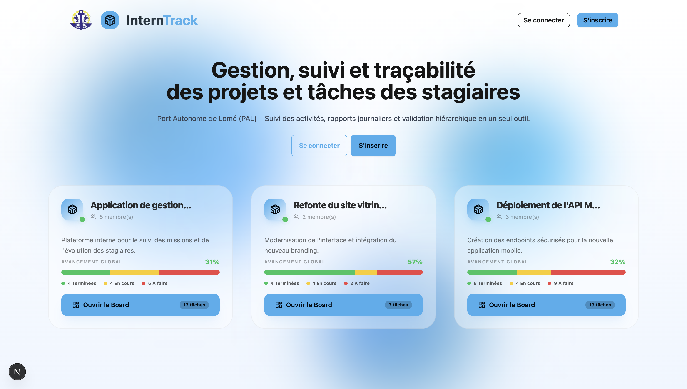

## 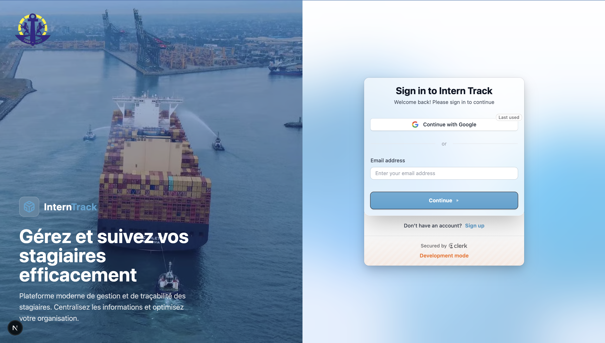

## 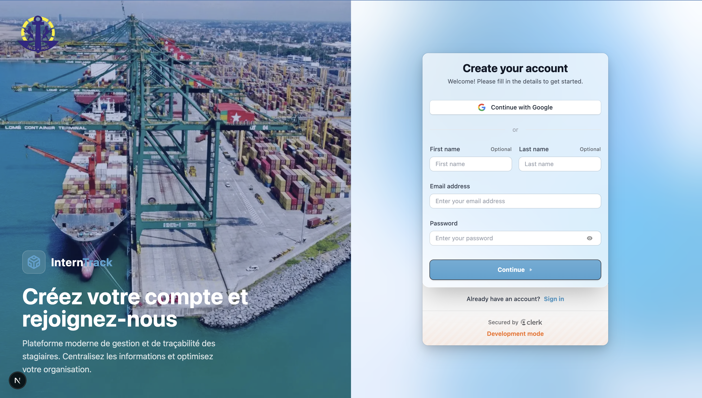

## 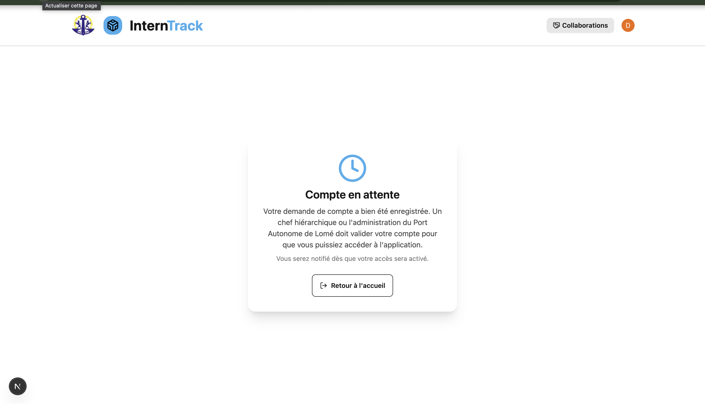

## 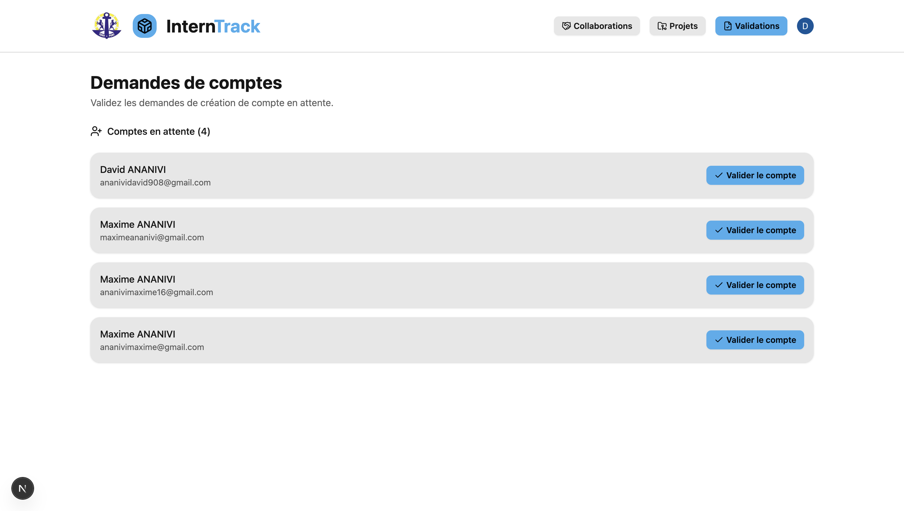

## 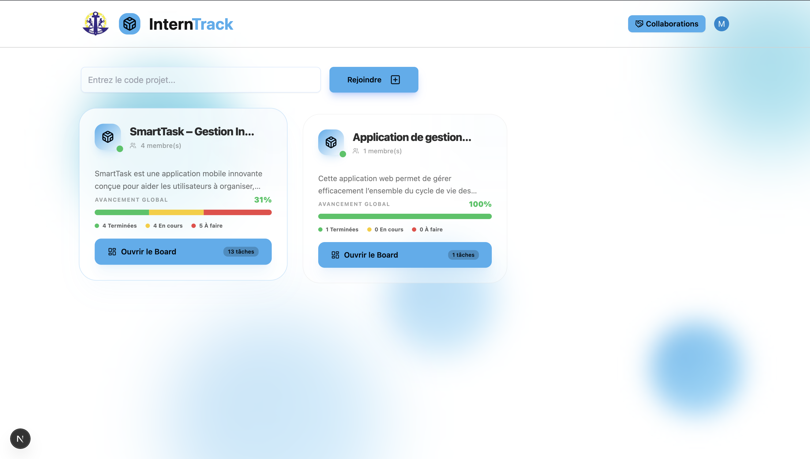

## 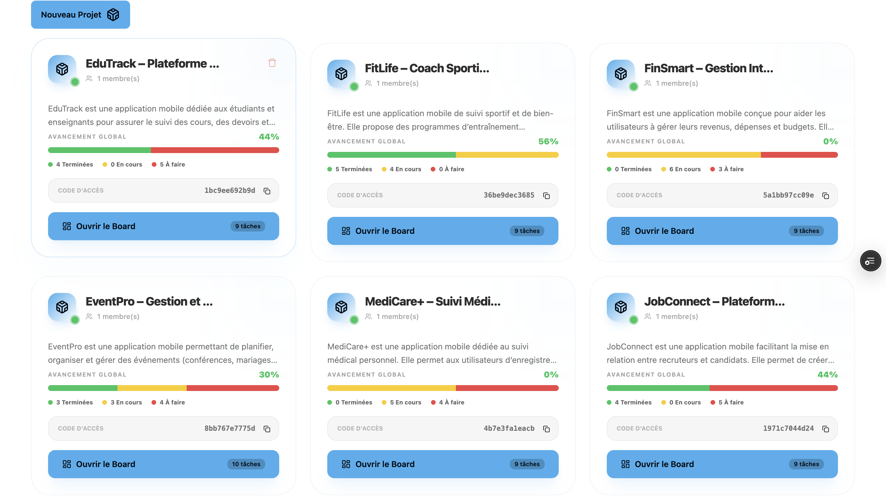

## 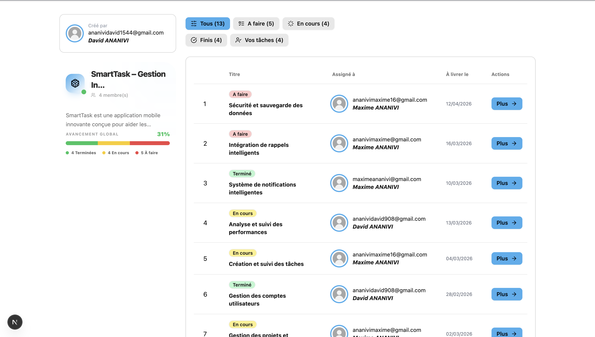

## 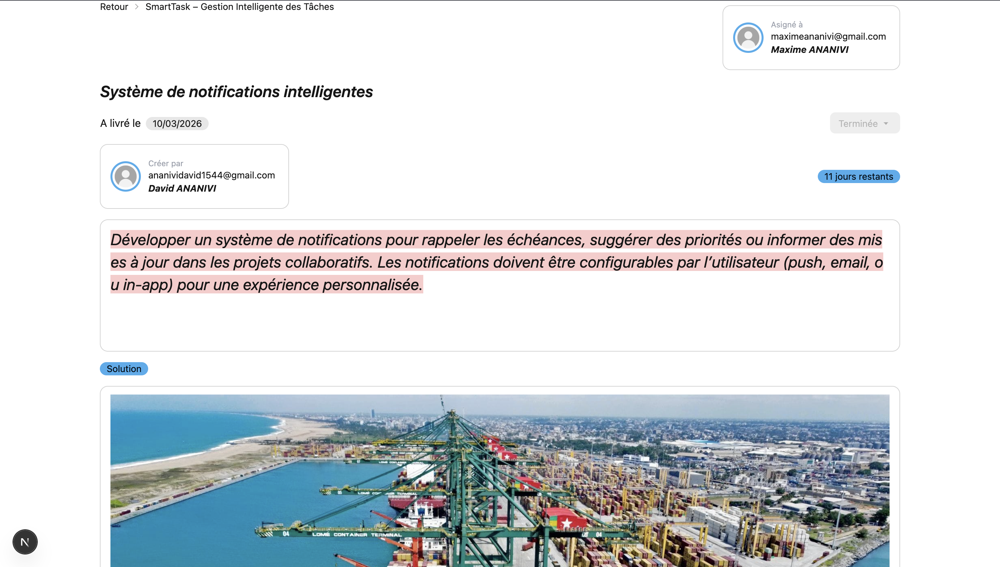

## 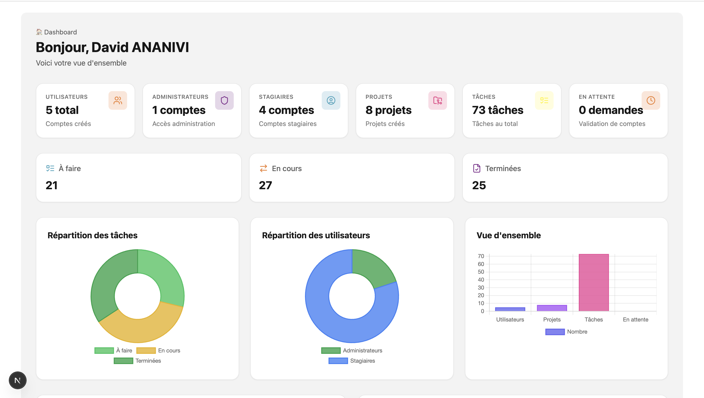

## 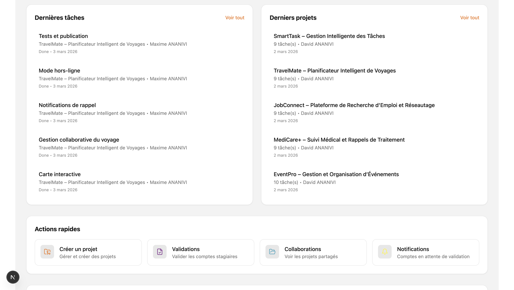

------------------------------------------------------------------------

## 🗄️ 1. Base de données & Installation

### 📦 Installation des dépendances

``` bash
npm install --legacy-peer-deps
```

### 🚀 Lancement du serveur de développement

``` bash
npm run dev
```

### 🛠️ Prisma (Génération & Migration)

``` bash
npx prisma generate
npx prisma migrate dev --name init_intertrack
```

------------------------------------------------------------------------

## ⚙️ Configuration des rôles et statuts

Si des utilisateurs existent déjà en base sans les champs `role` et
`accountStatus`, la migration ajoutera automatiquement :

-   `role = 'STAGIAIRE'`
-   `accountStatus = 'PENDING'`

------------------------------------------------------------------------

### 🔑 Activer un compte administrateur (premier déploiement)

``` sql
UPDATE "User"
SET role = 'ADMIN',
    "accountStatus" = 'ACTIVE'
WHERE email = 'votre-email-admin@pal.tg';
```

------------------------------------------------------------------------

### ✅ Activer les comptes existants

``` sql
UPDATE "User"
SET "accountStatus" = 'ACTIVE'
WHERE "accountStatus" = 'PENDING';
```

------------------------------------------------------------------------

## 👥 2. Rôles et Flux Applicatif

### 🔵 ADMIN

-   Validation des comptes utilisateurs\
-   Création et gestion des projets\
-   Assignation des tâches aux stagiaires

### 🟢 STAGIAIRE

-   Consultation des projets assignés\
-   Mise à jour du statut des tâches

------------------------------------------------------------------------

## 🔄 Processus d'inscription

Tout nouveau compte créé via l'inscription possède :

-   Rôle : **STAGIAIRE**
-   Statut : **PENDING**

Le compte doit être validé par un **ADMIN** avant d'être actif.

------------------------------------------------------------------------

## 🏗️ Stack Technique

-   **Frontend** : Next.js + Tailwind CSS + DaisyUI\
-   **Backend** : API Routes (Next.js)\
-   **ORM** : Prisma\
-   **Base de données** : PostgreSQL (Supabase)

------------------------------------------------------------------------

## 📄 Licence

Projet académique -- Développé dans le cadre d'un stage / projet
universitaire.
